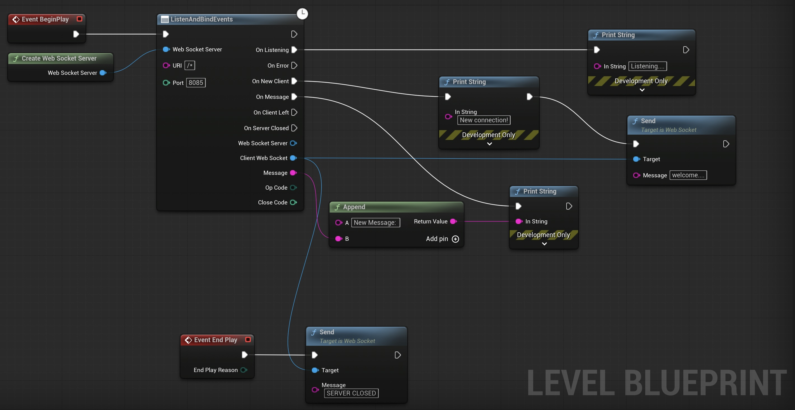
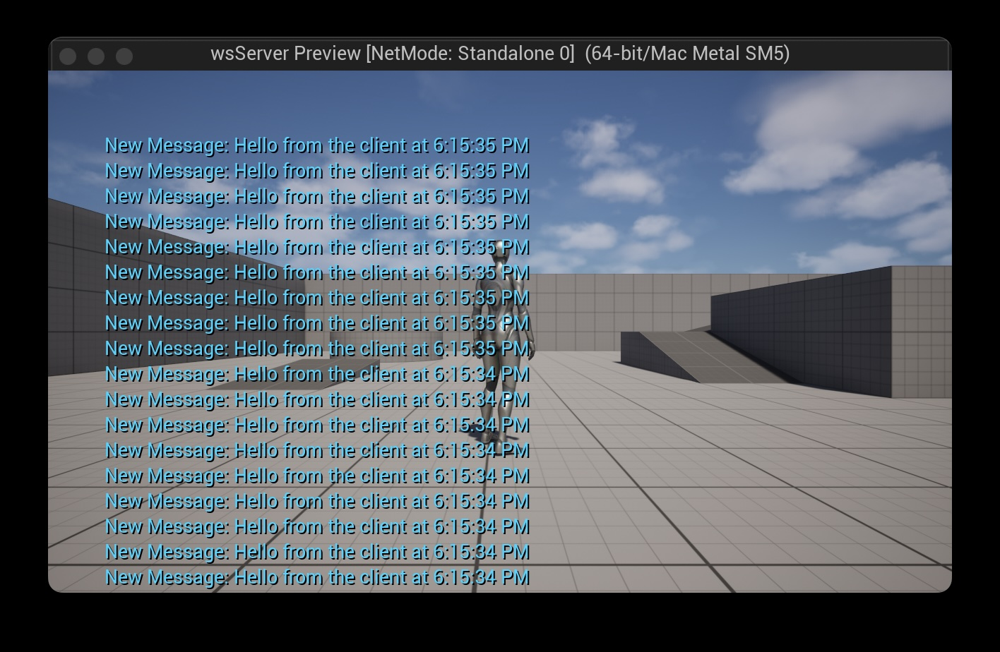

# UE5 Web Socket server (blueprint only) example

## Requirements
- Unreal Engine 5.0 or later.
- WebSocket with Blueprint Plugin: https://www.fab.com/listings/c52d0c7a-1104-4263-bf71-668a56ebfa43
- Node.js: https://nodejs.org/en/download/ (for testing the client).

## Installation
1. Clone the repository to your local machine.
2. Open the `wsServer/wsServer.uproject` file in Unreal Engine 5.

## Blueprint Example

## Testing the WebSocket Server
1. Open the `wsServer` project in Unreal Engine 5.
2. Click the "Play" button to start the WebSocket server.
3. cd to `wsClient` folder
4. Run `npm install` to install the required dependencies (only once).
4. Run `node client.js` to start the WebSocket client.
5. You should see the client sending messages to the server and receiving responses.

